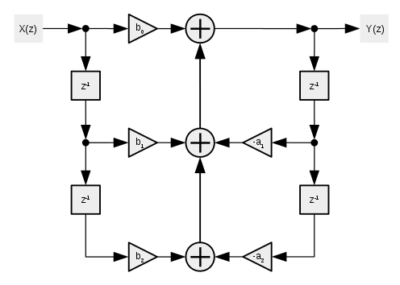
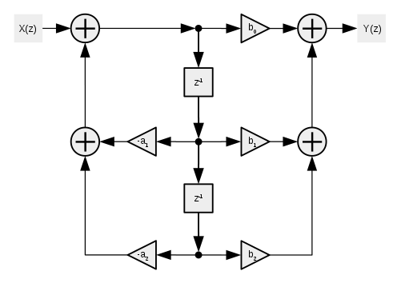
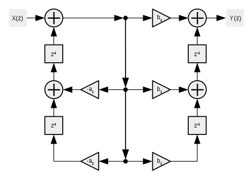

# OrfanidisBiquad
Audio EQ Peak Band with no digital "cramping", and selectable transformations (Direct Form I & II, plus Direct Form I & II transposed).

(Shown below; a +30dB bell-shaped boost at 10kHz, performed on a harmonic-rich 20Hz sawtooth-wave in Reaper)

(write-up and comparisons to follow)

Reference: Original paper (including MATLAB code) "Digital Parametric Equalizer Design With Prescribed
Nyquist-Frequency Gain", Sophocles J. Orfanidis, 1996; https://www.ece.rutgers.edu/~orfanidi/ece348/peq.pdf

# Transformations
Determing an output transfer function (Y(z)), given an input value (X(z)) and six coefficients (b0, b1, b2, a1, and a2 - all of which are pre-scaled by 1/a0);

+ X(z) = input sample

+ Y(z) = output sample

+ b0, b1, etc.. = coefficient gain multiplier

+ (+) = summing point (addition)

+ z-1 = unit (single sample) delay

+ <-, ->.. etc = signal flow direction 

# Direct Form I;

# Direct Form II;

For the "transposed" forms, all terms are inverted (signal flow reversed, summing points become split points, and multpiliers swap positions);

# Direct Form I Transposed;

# Direct Form II Transposed;

# Observations on the various Direct Form topologies in real-time audio use-cases;

As depicted in the above diagrams, the Direct Form I ("DFI") and II ("DFII") utlize a chain of single-sample unit delays in a feedback arrangement, with the coefficients a1 through to b0 controlling the gain at various points in the feedback network (in the case of DFII, actually two feedback networks).

+ DFI utlizes a total of four samples of delay, with DFII requiring only two samples. The higher number of unit delays present in the DFI structure make this arrangement relatively unstable when modulating the parameters while simultaneously passing audio, resulting in loud (and potentially damaging) clicks and pops in the resulting audio. In our test workbench (running as a VST3 effect in Reaper), even just moderate sweeps of the filter frequency control can incur signal overloads significant enough to trigger the in-built "channel auto-mute" safety feature, which avoids sending potentially damaging signals to the audio playback device and speakers.

+ DFII, using less unit delays in it's architecture, produces much less significant artefacts during parameter modulation; in all but the most extreme cases, the output remains relatively benign. However, this structure is far more prone to "round-off" errors due to a narrowing computational precision in certain parts of the feedback network; this can manifest as a kind of "quantization noise" - much like un-dithered fixed-point audio - creeping well into the audible range, and in some cases enveloping low-amplitudinal parts of the input signal. This can be particularly extenuated by very large boosts of a tight "bell" shape in the lowest bass frequencies, causing strong quantization-error noise to permeate the upper-mid and treble ranges of the signal (image to follow).

The two "transposed" forms provide us the same output characteristics for the same number of components, but arranged in inverse terms as compared with the non-transposed forms; summing points become split points, gain multpiliers swap positions within the network, and the entire signal flow is reversed (our images are also flipped around to keep the input and output directions visually aligned with the previous structures). The results are interesting; 

+ The transposed Direct Form I ("DFI(t)") utilizes the four unit-delays of it's predecessor, meaning instability while passing audio during parameter modulation, yet also incurs the exact same "round-off error" and quantization noise as the original DFII structure.

+ The Transposed Direct Form II, on the other hand, similarly uses only two unit-delays as per it's predecessor, making it much more amenable to audio-rate modulation; meanwhile, this form also successfully manages to avoid the higher "round-off" error and quantization noise of it's predecessor (and the DFI(t) structure).

# With all four arrangements compared;

+ DFI = four delay units (unstable modulation and higher footprint), higher precision (less quantization noise)
+ DFII =  two delay units (stable modulation and lower footprint), lower precision (more quantization noise)
+ DFI(t) = four delay units (unstable modulation and higher footprint), lower precision (more quantization noise)
+ DFII(t) = two delay units (stable modulation and lower footprint), higher precision (less quantization noise)

As we can observe from the above comparison, our DFII(t) structure is the most favourable in both cases - it has only two delay units, meaning it is more stable under modulation, favourably comparable to the DFII structure; it also produces less quantization noise, comparable to the DFI structure in this regard. The lower unit delay count also produces a lower memory footprint in realtime use.

Our DFI(t) structure performs the most poorly in the two highlighted cases - the quantization round-off error is unfavourably comparable to the DFII structure, while the four delay units contribute to heavy and unpredictable click/pop "zipper" noise underparameter modulation and also a higher memory footprint.

A parameter smoother may be applied in a future version. In testing so far, it has been observed that a smoothed parameter, derived from a clock source that is likely asynchronous to the audio buffer clock, generates an unusual notch-like filter effect on the resulting audio spectrum; it's deterministic frequency is seemingly related in periodicity to the parameter smoothing clock speed.

The quantization noise created by the feedback network's computational round-off errors can be seemingly entirely negated by increasing processing precision from Floats to Doubles; the resulting noise floor falls not only well below the audible threshold, but also below the reach of abilities of our testing software.

Furthermore, increasing precision to Doubles also seemingly eradicates the "notch-like periodicity" that our parameter smoother incurrs on the waveform to imperceptible levels.

However, out of sight and out of mind does not mean out the window; we are able to produce several very pronounced audible artefacts in three of the four structures when processing in Floats (commonly deemed to be a beyond acceptable processing precision for audio purposes, to be debated elsewhere). Indeed only the Transposed Direct Form II manages favourably in all cases, and thus appears to be the prime candidate transformation for Biquad-based Equalizers in all audio application contexts at the time of writing.

^ Reference: Transformations images taken from: https://en.wikipedia.org/wiki/Digital_biquad_filter
